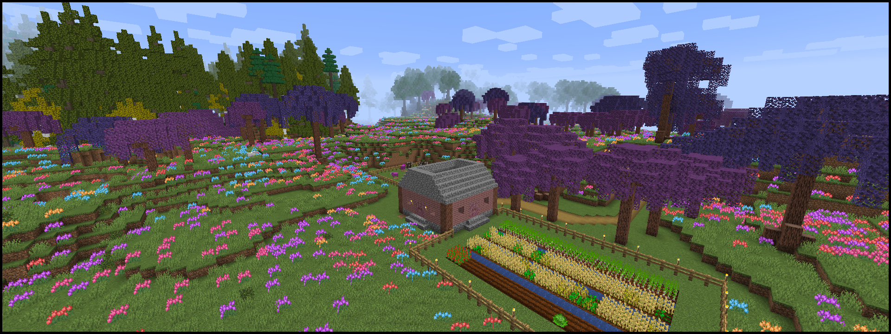

# #obsidian 1.16 Fabric Modpack

This is another modpack by and for the **#obsidian Research** community with [Fabric](https://fabricmc.net/) mods, allowing us to experience new things as they're being developed. A list of mods can be found [here](packs/obsidian_fabric.voodoo.kts) - sorted and annotated! More will be added over time, as they become available or compatible with our current set of mods.

## Download and Installation

We use the modpack development tool [Voodoo](https://github.com/DaemonicLabs/Voodoo) for easier development, version control, management of mods, keeping them up-to-date, and to have a self-updating MultiMC instance for our players.

Simply drag this link >> [`obsidian_fabric.zip`](https://meowface.org/copygirl/obsidian_fabric.zip) << and drop it into the main [MultiMC](https://multimc.org/) window to create a new instance. On first launch, an error will likely appear. In that case just launch it again. It will then ask you which optional mods you want and download everything for you before starting the game.

If you'd like to play on the official server, feel free to poke **copygirl**.
